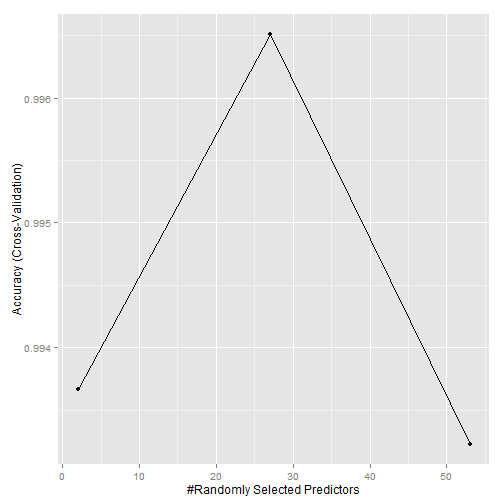

Practical Machine Learning Project Writeup
========================================================

Summary
--------------------------------------------------------

The following is a writeup of the Human Activity Recognition (HAR) Dataset. The data is a collection of exercise monitoring devices such as the Nike FuelBand, or the FitBit. 6 participants performed a series of exercises in five separate ways (or classes): Sitting, Sitting Down, Standing, Standing Up, and Walking. From the data collected I perform sufficient analysis to be able to accurately predict the class used when presented with test cases that are missing the class column. The original dataset can be found here: http://groupware.les.inf.puc-rio.br/har

Data Loading and Cleaning
--------------------------------------------------------

The first step is to load the data. We are presented with two data files. One representing the original HAR data and the second representing test data that will later be used to predict the class.


```r
HAR_dataset <- read.csv("pml-training.csv")
test_dataset <- read.csv("pml-testing.csv")
```

We first remove any pointless columns that shouldn't be used when predicting as they don't contain pertinent data.


```r
HAR_new <- HAR_dataset[, 7:160]
test_new<- test_dataset[, 7:160]
```

When viewing the distribution of the classe field, we do see that the frequency of A tends to be higher and could become zero_variance predictors. 59 are removed from the dataset.


```r
library(caret)
```

```
## Loading required package: lattice
## Loading required package: ggplot2
```

```r
data.frame(table(HAR_new$classe))
```

```
##   Var1 Freq
## 1    A 5580
## 2    B 3797
## 3    C 3422
## 4    D 3216
## 5    E 3607
```

```r
#Before
dim(HAR_new)
```

```
## [1] 19622   154
```

```r
#Remove nzv
nzv <- nearZeroVar(HAR_new[, -160])
HAR_new <- HAR_new[, -nzv]
test_new <- test_new[, -nzv]

#After
dim(HAR_new)
```

```
## [1] 19622    95
```

Removing NA values will eliminate errors in modeling. Any NA's will cause the fitting to fail. 41 are removed from the dataset.


```r
NA_Data <- colSums(is.na(HAR_new)) > 0
HAR_new <- HAR_new[, !NA_Data]
test_new <- test_new[, !NA_Data]

#After
dim(HAR_new)
```

```
## [1] 19622    54
```

We now set a seed for reproducibility and split the training data.


```r
set.seed(1070)
trainIndex <- createDataPartition(HAR_new$classe, p = 0.7, list = FALSE)
training <- HAR_new[trainIndex, ]
testing <- HAR_new[-trainIndex, ]
```

The data is split into 70/30 into training and testing.

Model Training and Fitting
--------------------------------------------------------

We now train and fit the model using Random forest with cross validation, repeating 5 times.


```r
fitControl <- train(classe ~ ., data = training, method = "rf", trControl = trainControl(method = "cv", number = 5))
```

```
## Loading required package: randomForest
## randomForest 4.6-10
## Type rfNews() to see new features/changes/bug fixes.
```

```r
ggplot(fitControl)
```

 

The accuracy is shown above in the plot.

Prediction and Error
--------------------------------------------------------

We can now predict the split tested data based on the trained model. A confusion matrix will solidify the accuracy of the model on the test data. We can see the out of sample error is around 99.6%.


```r
predTesting <- predict(fitControl, newdata = testing)
confusionMatrix(predTesting, testing$classe)
```

```
## Confusion Matrix and Statistics
## 
##           Reference
## Prediction    A    B    C    D    E
##          A 1674    6    0    0    0
##          B    0 1133    8    0    0
##          C    0    0 1018    7    0
##          D    0    0    0  957    0
##          E    0    0    0    0 1082
## 
## Overall Statistics
##                                         
##                Accuracy : 0.996         
##                  95% CI : (0.995, 0.998)
##     No Information Rate : 0.284         
##     P-Value [Acc > NIR] : <2e-16        
##                                         
##                   Kappa : 0.995         
##  Mcnemar's Test P-Value : NA            
## 
## Statistics by Class:
## 
##                      Class: A Class: B Class: C Class: D Class: E
## Sensitivity             1.000    0.995    0.992    0.993    1.000
## Specificity             0.999    0.998    0.999    1.000    1.000
## Pos Pred Value          0.996    0.993    0.993    1.000    1.000
## Neg Pred Value          1.000    0.999    0.998    0.999    1.000
## Prevalence              0.284    0.194    0.174    0.164    0.184
## Detection Rate          0.284    0.193    0.173    0.163    0.184
## Detection Prevalence    0.285    0.194    0.174    0.163    0.184
## Balanced Accuracy       0.999    0.997    0.995    0.996    1.000
```

With certainty of the accuracy of the model based on the split test data, we can now predict based up the provided testing data


```r
predFinal <- predict(fitControl, newdata = test_new)
table(predFinal)
```

```
## predFinal
## A B C D E 
## 7 8 1 1 3
```
